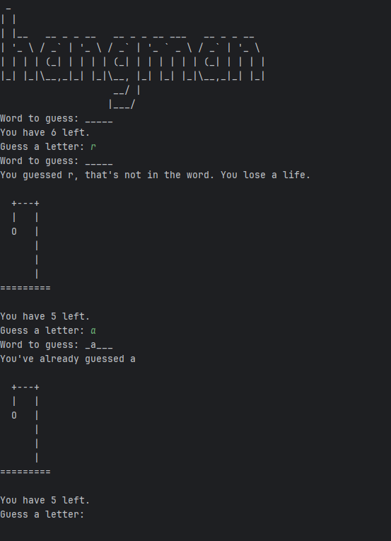

# 🎯 Hangman Game – Python Project

A simple **Hangman** game written in Python.  
This project was created as part of *Dr. Angela Yu’s 100 Days of Code – The Complete Python Pro Bootcamp* on Udemy.  
It was a fun way to practice Python fundamentals like loops, conditionals, lists, and string manipulation.

---

## 🕹️ How to Play
1. Run `main.py` in your terminal or IDE.  
2. The program will choose a random word from the word list.  
3. You have to guess the word one letter at a time.  
4. Each incorrect guess decreases your remaining lives — once they reach zero, the game ends.  
5. Try to guess the full word before you run out of lives!

---

## 📂 Project Files
- `main.py` → main game logic  
- `hangman_art.py` → contains ASCII art for the hangman stages and logo  
- `hangman_words.py` → contains the list of possible words  

---

## 🧰 Requirements
This project uses only **Python’s built-in libraries** — no external dependencies required.  
Just make sure you’re running Python 3.x.

---

## 🚀 Run the Game
```bash
python main.py


